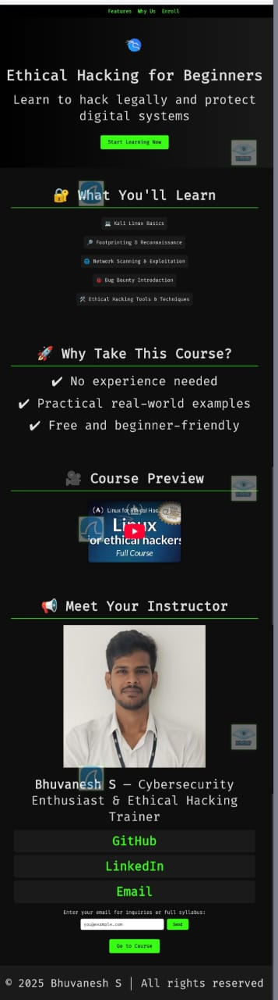
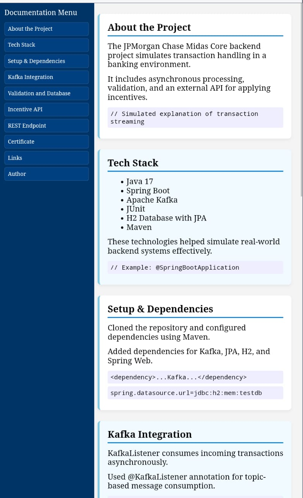
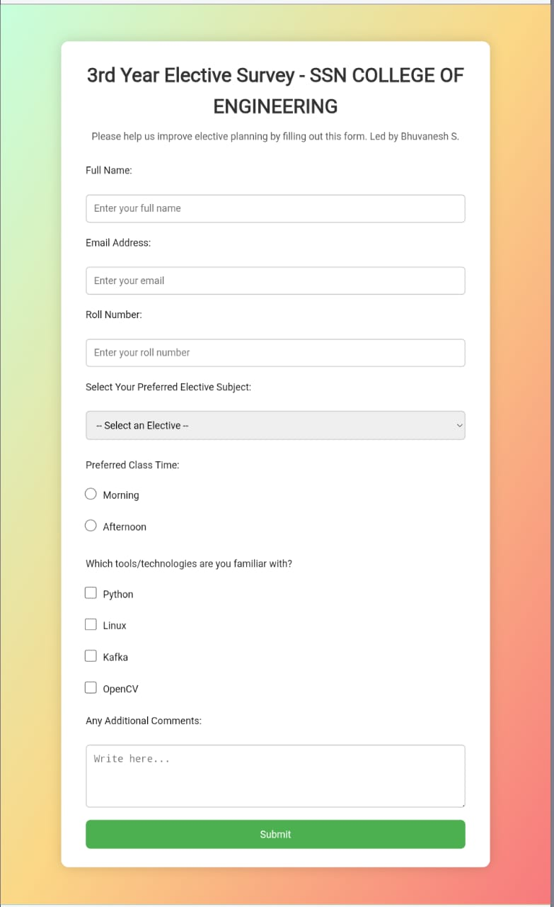
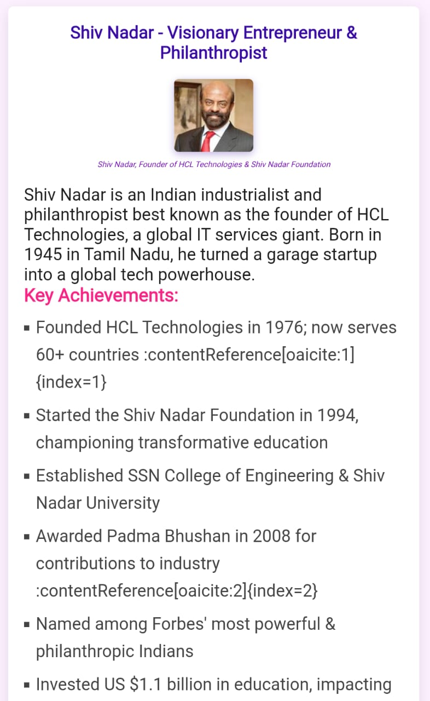
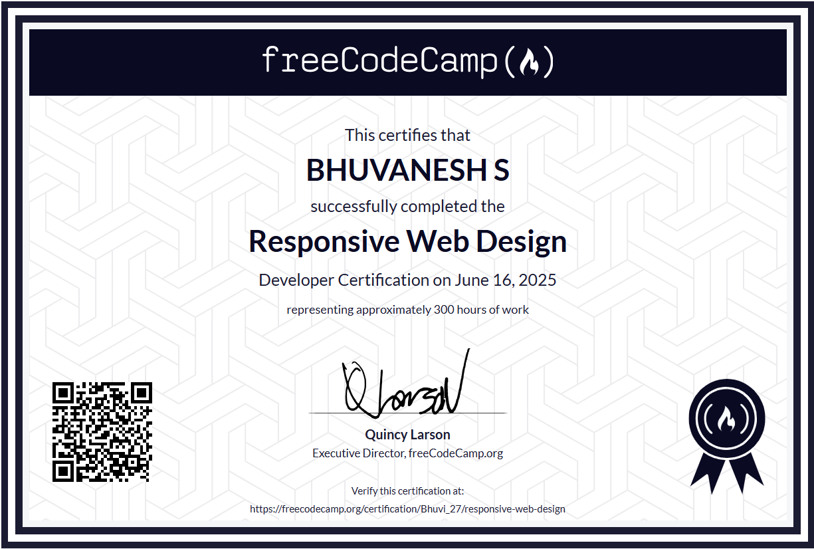

# 🏁 FreeCodeCamp Responsive Web Design Certification Projects

## 📘 Overview

This repository contains my completed projects for the [freeCodeCamp Responsive Web Design Certification](https://www.freecodecamp.org/learn/responsive-web-design/), earned on **June 16, 2025**.  

The certification involves building five HTML & CSS projects that showcase modern responsive design principles. All projects were built using:

- **HTML5**
- **CSS3**
- **Responsive Web Design**
- **Flexbox**
- **Media Queries**

> 📌 To earn the certificate, students must complete each project according to provided user stories and pass all associated test cases on [freeCodeCamp.org](https://www.freecodecamp.org).

---

## 📁 Projects Included

### 1. 📢 Product Landing Page

A professional landing page promoting a product, service, or event.  
This project involved organizing content with clear CTAs, using Flexbox and media queries to ensure adaptability and visual clarity.  
Includes responsive layout, embedded media, and functional navigation links.

📂 [View Code](./PRODUCT-LANDING-PAGE)

---

### 2. 🌐 Personal Portfolio Webpage

A multi-section portfolio website to showcase personal projects, certifications, and contact links.  
Features include smooth scrolling, hover effects, responsive image scaling, and a dark-themed UI with glowing text.  
This project demonstrates practical use of **responsive design, modern UI, and semantic HTML**.

📂 [View Code](./PERSONAL-PORTFOLIO-PAGE)

---

### 3. 📄 Technical Documentation Page

A sidebar-based documentation layout that mimics technical docs like MDN or developer portals.  
Built using Flexbox for layout and media queries for responsiveness.  
Focus was on **navigability, content hierarchy, and code readability**.

📂 [View Code](./TECHNICAL-DOCUMENTATION-PAGE)

---

### 4. 🧾 Survey Form

A responsive survey form that collects user feedback with various input types like radio buttons, checkboxes, dropdowns, and textarea.  
Includes labels, form validation, and responsive layout using Flexbox.  
It mimics a real-world data collection form and ensures usability across devices.

📂 [View Code](./SURVEY-FORM)

---

### 5. 🏛️ Tribute Page

A clean, semantic web page dedicated to a historical or notable figure.  
It demonstrates proper use of HTML structure (like `<section>`, `<figure>`, `<blockquote>`), and is fully responsive across screen sizes.  
Focus was on **accessibility, responsiveness, and readability**.

📂 [View Code](./TRIBUTE-PAGE)

---

## 🛠️ Tech Stack Used

- ✅ **HTML5** – Semantic structure and accessibility
- ✅ **CSS3** – Styling and layout control
- ✅ **Responsive Design** – Mobile-first and fluid layouts
- ✅ **Flexbox** – One-dimensional responsive layouts
- ✅ **Media Queries** – Adaptive styling based on screen size

---

## ✅ Certificate of Completion

> I have successfully completed the **Responsive Web Design Certification** from freeCodeCamp by building and submitting all required projects.

---

## 📬 Contact

**👨‍💻 Author:** Bhuvanesh S  
🎓 3rd Year Computer Science Student at SSN College of Engineering  
📧 Email: bhuvaneshcsessn@gmail.com  

   Linked IN
  
   Github
  

